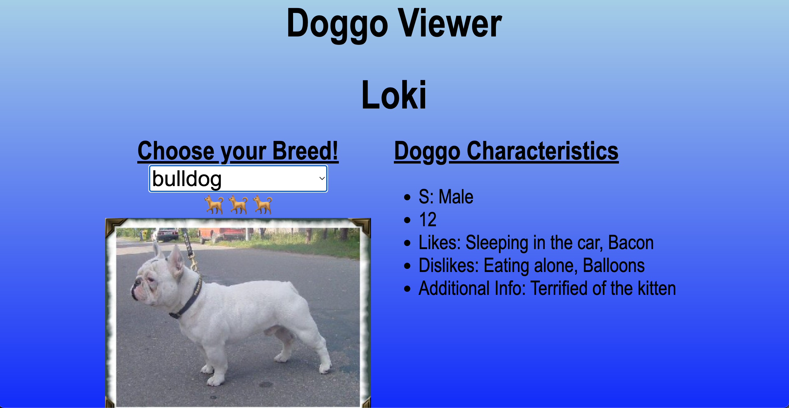

# Early Learning Project - Doggo Generator

A small practice project built to explore calling public APIs and updating the DOM with JavaScript.  
This project focuses on fetching external data and combining it with locally defined information to generate dynamic content.

**Link to project:** Not deployed / local development only

## How It's Made:

**Tech used:** HTML, CSS, JavaScript

This project was intentionally kept simple to focus on learning how to work with APIs and dynamic data.  
Users select a dog breed from a dropdown menu, which triggers a request to a public dog image API to retrieve a picture of the selected breed.

In addition to the API call, the app pulls from a local JavaScript object containing random dog details such as names, ages, and fun facts. These two data sources are combined to generate a fictional profile for each dog.

The project emphasizes basic JavaScript concepts including event handling, fetch requests, and updating the DOM based on user interaction.

## Optimizations

Since this is an early learning project, optimizations are minimal. Small improvements were made to keep the logic readable and ensure the UI updates correctly when a new breed is selected.

## Future Improvements

Potential next steps could include improving error handling for failed API requests, expanding the set of dog facts, enhancing the UI, or adding loading states while images are being fetched.

## Lessons Learned:

This project helped me gain hands-on experience working with public APIs and using JavaScript to dynamically update the page.  
It reinforced core concepts around asynchronous requests and DOM manipulation.
